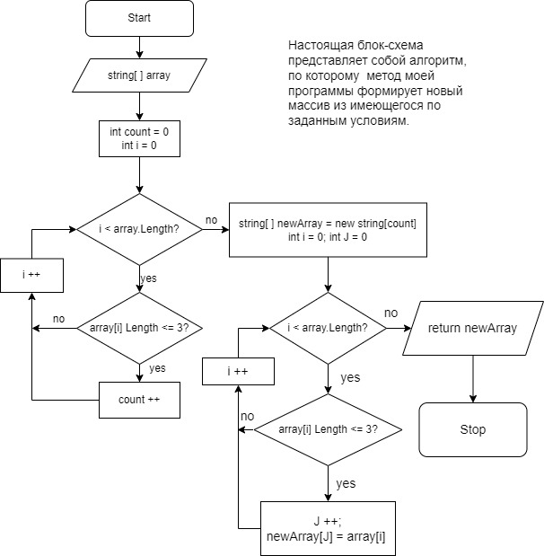

## Итоговая проверочная работа.
_**Напишите программу, которая из имеющегося массива строк,
формирует массив из строк, длина которых меньше либо равна 3 символам.**_

 Для решения задачи мною был создан *метод*, в качестве аргумента принимающий уже имеющийся массив из нескольких строковых значений.
### Блок-схема алгоритма, по которому работает метод 

* Для того, чтобы определить длину нового массива я запускаю цикл, который перебирает элементы исходного массива, проверяет их на соответствие условию
и подсчитывает такие элементы.
 * Полученный результат использую в качестве параметра "size", при объявлении нового массива. 
 * Снова прохожу циклом
по всем элементам исходного массива и, в случае соответствия заданному условию, присваиваю такое же значение следующему элементу в новом массиве.
Вместе с тем инкременирую переменную "j", которая определяет текущий индекс нового массива.
* Далее объявляю метод, который выводит на экран элементы нового массива.Это реализовано опять же циклом, который переходя от элемента к элементу запускает метод *"Console.Write()".*
* И, наконец, вызываю оба эти метода в последних 2-х строчках программы.
